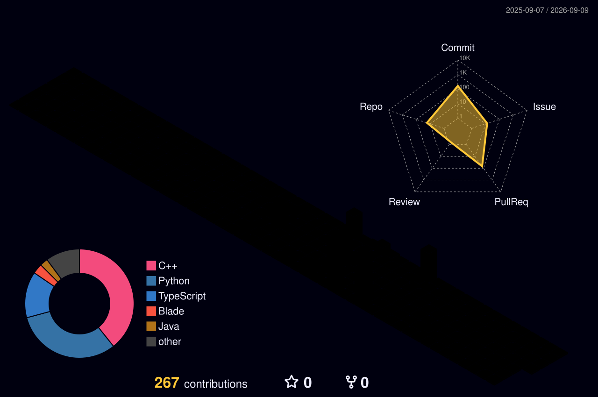

<!-- HERO -->

  

  <b>Python / Java Backend Developer</b> · <b>ITMO University</b>

  Backend engineer who cares about the things that break in production: flaky integrations, queries that quietly get slower, and services that fail in confusing ways instead of failing cleanly.

  
  
  
  
  

  

---

## About

I'm a backend developer with commercial experience at **SkillFactory** and **MathGPTPro**, plus hackathon wins and ongoing research work at **ITMO University**. Most of my work has been about the boring side of backend: flaky third-party APIs, endpoints that quietly get slower under real traffic, N+1 queries nobody caught in review, and team workflows that drift as people come and go.

What I care about: turning fragile systems into boring, predictable ones. Retries with idempotency keys instead of duplicated writes. Composite indexes and `EXPLAIN ANALYZE` instead of "let's just add more caching." Structured logs that make on-call triage take minutes instead of hours. Circuit breakers so a flaky upstream doesn't take down everything around it.

I'm looking for backend roles where reliability and clean architecture aren't an afterthought — where the team treats them as part of the work, not something you get to once features ship.

---

## Professional Experience

<table width="100%">
  <tr>
    <td width="22%" align="center" valign="middle">
      
        
      <b>1 year 8 months</b> · Remote
    </td>
    <td width="78%" valign="middle">
      <b>Python Backend Developer / Technical Mentor</b>
        
      Built and stabilized backend services where reliability mattered more than feature velocity. Hardened a flaky third-party integration, fixed a slow hot-path endpoint, and reviewed capstone-level code for students learning to ship real systems.
        
      <code>FastAPI</code> · <code>Pydantic</code> · <code>SQLAlchemy</code> · <code>PostgreSQL</code> · <code>Redis</code> · <code>Celery</code> · <code>Docker</code> · <code>Spring Boot</code>
    </td>
  </tr>
  <tr><td colspan="2">&nbsp;</td></tr>
  <tr>
    <td width="22%" align="center" valign="middle">
      
        
      <b>6 months</b>
        
      
    </td>
    <td width="78%" valign="middle">
      <b>Python Developer</b>
        
      Joined by winning a closed hackathon. Replaced fragile manual processes with reproducible automation — validation utilities that fail loudly on bad input, and parameterized scripts that anyone on the team can run and get the same result.
        
      <code>Python</code> · <code>validation</code> · <code>automation</code> · <code>workflow design</code>
    </td>
  </tr>
  <tr><td colspan="2">&nbsp;</td></tr>
  <tr>
    <td width="22%" align="center" valign="middle">
      
        
      <b>2025 — present</b>
        
      
    </td>
    <td width="78%" valign="middle">
      <b>Team and Research Projects</b>
        
      Won a closed ITMO hackathon (technical results only, no soft criteria). Contributing to team and research work — bringing implementation discipline to research prototypes that need it. Top-4 in Russia for Computer Science (EduRank), QS World #711.
        
      <code>research</code> · <code>integrations</code> · <code>code review</code> · <code>team projects</code>
    </td>
  </tr>
  <tr><td colspan="2">&nbsp;</td></tr>
  <tr>
    <td width="22%" align="center" valign="middle">
      
        
      <b>4+ years</b>
        
      
    </td>
    <td width="78%" valign="middle">
      <b>Operations Owner + AI Agent Integrator</b>
        
      Ran a multi-store operation through 30,000+ completed orders. Designed the workflow as a real pipeline — defined contracts, owners, and failure modes for each stage — then built an AI-agent layer on top so it could scale without scaling headcount.
        
      <code>AI agents</code> · <code>workflow design</code> · <code>human-in-the-loop</code> · <code>guardrails</code>
    </td>
  </tr>
</table>

---

### SkillFactory — Python Backend Developer / Technical Mentor

Worked on backend services where the brief wasn't just "ship features" but "make this thing actually reliable." Combined hands-on coding with code review and architecture review on student capstone projects.

**Case 1 — Stabilizing a flaky third-party API**

The integration was the single biggest source of incidents. It timed out under load, retried mutating requests and ended up duplicating them, and cascaded failures whenever the upstream API had a bad day. Users got inconsistent results for the same input. On-call engineers spent hours digging through unstructured logs trying to figure out whether *we* broke something or *they* did.

I pulled the integration into its own client layer with a clear contract. Added retry with exponential backoff and jitter, idempotency keys on every mutating call so safe retries stopped causing duplicates, dead-letter handling for messages that would never succeed no matter how many times we retried, Redis TTL caching for stable GET-style responses, and a circuit breaker so we'd stop hammering the upstream once it was obviously down. Replaced ad-hoc logging with structured logs grouped by error class — timeout, 5xx, 4xx, parse errors, contract mismatches — so triage became a 30-second job instead of a 2-hour archaeology expedition.

Result: duplicate writes went to zero. The service started failing cleanly when the upstream was down instead of producing corrupt state. Incident time-to-diagnosis dropped a lot, because the logs now told you what kind of failure happened. The integration stopped showing up in postmortems.

**Case 2 — Fixing a slow endpoint, the right way**

A high-traffic read endpoint was getting slower. The team's first instinct was "we need more caching." That wasn't actually the problem. The real issues were heavy joins written without thinking about cost, ORM-driven N+1 patterns from lazy-loaded relations, and missing indexes on the columns the queries actually filtered by.

I started with `EXPLAIN (ANALYZE, BUFFERS)` on the slow queries to find the *real* bottlenecks instead of guessing. Rewrote the bad queries with explicit joins and `selectinload` to kill the N+1. Added composite indexes that matched the actual query predicates — not single-column "just in case" indexes that would never be used. *Then,* and only then, added a narrow Redis TTL cache for read-heavy reference data where it was genuinely justified.

Result: response times stabilized under load, database pressure dropped on the repeat read paths, and the endpoint stopped showing up on the weekly incident list. Bonus: the team now had a concrete template for how to actually diagnose "the DB is slow" instead of reaching for caching every time.

**Mentorship & code review**

Reviewed code and architecture for capstone-level student projects. The goal was always to teach people to *see* the problem themselves — not to hand them solutions. I pushed hard on debuggability under failure, reasoning about what *could* go wrong, and not just whether the tests pass today. Reviews covered API contract design, error handling, schema migrations, and how to write code that's testable in the first place.

---

### MathGPTPro — Python Developer

Got in by winning a closed hackathon. The work was about taking processes that lived in people's heads and turning them into things the team could actually rely on.

**Case 1 — Automating validation of analytical pipelines**

The pipelines worked great on clean inputs and broke silently on edge cases — empty inputs, off-by-one boundaries, surprise nulls, subtle unit mismatches. The team absorbed this as manual re-checking, which scaled with workload and was quietly the bottleneck on output.

I built Python validation utilities with explicit correctness criteria written as actual checks, not comments. Covered edge cases systematically. Made output formatting uniform so results from different runs were actually comparable. Designed every utility so a bad input would fail loudly with a useful error message — never silently produce wrong output.

Result: manual verification got replaced by automated checks. Engineering time moved from re-checking to actually improving things. Confidence in pipeline output stopped depending on who ran it.

**Case 2 — Making internal scenarios reproducible**

The same checks gave different results depending on who ran them. Workflows lived in execution habits and chat history instead of shared artifacts — classic tribal knowledge. If the wrong person took a vacation, things broke.

I standardized operations into parameterized Python scripts with explicit input validation, documented assumptions, and clearly stated expected behavior. "Ask X how to do this" became "read the script and run it."

Result: reproducibility got measurably better, onboarding got faster, single-person dependencies dropped. Workflows became things you could actually review instead of stories people told each other.

---

### ITMO University — Team and Research Projects

- Won a closed ITMO hackathon — picked purely on technical results, no soft criteria.
- Contributing to team projects: development, external integrations, problem decomposition, code review. Bringing implementation discipline to research prototypes that need it.
- For context: ITMO is top-4 in Russia for Computer Science (EduRank), QS World #711, and a 7× ACM ICPC winner institution.

---

### E-commerce Operations Network — Where the Systems Thinking Came From

Not a software engineering title, and that's the point. Running a multi-store operation at 30,000+ orders teaches you the things that turn out to matter most in backend engineering — throughput, bottlenecks, idempotent processes, blast radius, observability, what good operator ergonomics looks like under pressure. By the time I encountered these as formal systems-design ideas, they weren't abstractions. They were things I'd already paid for in broken workflows.

**The operational model**

I designed the full execution pipeline: task intake → routing → distribution → execution control → result verification → accountability. Every stage had a defined contract, a defined failure mode, and a defined owner. It's basically the same discipline as designing a chain of backend services, except the runtime was humans and processes.

I found and removed bottlenecks by *measuring* where work actually stalled — not where it felt slow. Same instinct I now apply when I'm reading `EXPLAIN ANALYZE` output. **30,000+ completed orders** went through that system, with the kind of consistency you only get if the workflow itself is well-designed and not held up by heroics.

**AI agent integration — turning manual ops into a semi-automated system**

The manual pipeline eventually became the bottleneck itself. The fix wasn't "hire more people." It was building an AI-agent layer on top, so humans only handled the decisions that actually needed judgment.

- **Order tracking automation.** Agent flows pull order events from multiple stores, normalize them into one internal schema, and keep state up-to-date without manual polling or copy-paste between dashboards. Agents own the reconciliation loop. Humans only see the exceptions.
- **Customer communication agents.** AI agents handle first-touch customer messaging — order status questions, routine clarifications, expected-delivery responses. They have explicit escalation triggers — anything ambiguous, complaints, weird edge cases — that route to a human instead of guessing. Classic human-in-the-loop: agents do the 80% that's routine, humans handle the 20% that actually needs them.
- **Prompt and scenario design.** I wrote the playbooks the agents follow — tone, constraints, what they may and may not commit to on behalf of the store, and the exact conditions that trigger handoff. Versioned them as real artifacts, not "whatever the last edit happened to be," so behavior changes were traceable.
- **Guardrails and failure modes.** Designed for the cases when agents go wrong — fallback to human review, rate limits on outbound messages, hard "do not answer" categories for anything touching payment, refunds, or account changes. Same idea as DLQ and circuit breakers, applied to natural-language workflows: assume the system will sometimes be wrong and make failure safe.
- **Observability.** Every agent interaction is logged and reviewable. I sample them periodically to catch drift — the conversational equivalent of watching p99 latency for regressions.

The result: routine ops load shifted off humans, customer response latency dropped, and the operation grew to its current order volume **without scaling headcount linearly**. That was the whole point.

**Stores:** [Store 1](https://funpay.com/users/6852145/) · [Store 2](https://funpay.com/users/6255427/)

**What this taught me, in engineering terms:** how to design a pipeline, where to put the guardrails, how to pick the metrics that actually matter, how to build something that a different operator can still run tomorrow, and how to put AI into a real workflow as a *tool* — with explicit contracts and explicit failure handling — instead of as a magic black box.

---

## Technical Focus

<table>
  <tr>
    <td width="33%" valign="top">
      <h4 align="center">
         
        Backend — Python
      </h4>
      

        
        
        
        
        
        
      

      Typing, generics, dependency injection, middleware, exception handling, auth.
    </td>
    <td width="33%" valign="top">
      <h4 align="center">
         
        Backend — Java
      </h4>
      

        
        
        
        
        
      

      Java 17+, Spring MVC + Data JPA, validation, exception mapping, background jobs.
    </td>
    <td width="33%" valign="top">
      <h4 align="center">
         
        Databases
      </h4>
      

        
        
        
        
      

      Composite indexes that match real query predicates, N+1 diagnosis, deadlock analysis, transaction boundaries.
    </td>
  </tr>
  <tr>
    <td width="33%" valign="top">
      <h4 align="center">
         
        Data Access
      </h4>
      

        
        
        
      

      ORM + Core, migrations, eager vs. lazy loading trade-offs, session lifecycle.
    </td>
    <td width="33%" valign="top">
      <h4 align="center">
         
        Caching
      </h4>
      

        
        
        
        
      

      Strategy design, session storage, rate limiting, knowing when to cache and when not to.
    </td>
    <td width="33%" valign="top">
      <h4 align="center">
         
        Messaging &amp; Async
      </h4>
      

        
        
        
        
        
      

      Idempotency keys, dead-letter handling, exponential backoff with jitter, delivery guarantees.
    </td>
  </tr>
  <tr>
    <td width="33%" valign="top">
      <h4 align="center">
         
        Infrastructure
      </h4>
      

        
        
        
        
        
        
      

      CI/CD pipelines, container orchestration, production deploys.
    </td>
    <td width="33%" valign="top">
      <h4 align="center">
         
        Observability
      </h4>
      

        
        
        
      

      Structured logging, distributed tracing, real RCA instead of guessing.
    </td>
    <td width="33%" valign="top">
      <h4 align="center">
         
        Quality
      </h4>
      

        
        
        
      

      Unit + integration, contract testing, refactoring under coverage, real PR review discipline.
    </td>
  </tr>
  <tr>
    <td colspan="3" valign="top">
      <h4 align="center">AI Integration</h4>
      

        
        
        
        
        
      

      
Agent workflows with explicit contracts, escalation triggers, safe failure handling, and observability over agent behavior.

    </td>
  </tr>
</table>

---

## Tools

  

---

## Education & Certifications

**ITMO University** — *Computer Technologies* — **2025 — present**
*Top-4 in Russia for Computer Science (EduRank) · QS World #711 · 7× ACM ICPC winner institution*

| Type | Title | Provider | Year |
|---|---|---|---:|
| Degree | Computer Technologies | ITMO University | 2025 — present |
| Certification | Java SE 11 Developer | Oracle University | 2025 |
| Standardized Test | GRE (General Test) | ETS | 2025 |
| Course | Backend Developer | Yandex Practicum | 2023–2024 |
| Course | Frontend Developer | Yandex Practicum | 2023–2024 |
| Certification | Java Developer | SkillFactory | 2022 |
| Certification | Python Developer | SkillFactory | 2022 |

---

## Languages

| Language | Level |
|---|---|
| English | C1–C2 · IELTS 8.0 |
| Russian | Native |
| Uzbek | A2–B1 |

---

## 3D Contribution Graph

  

---

## GitHub Metrics

  

  

